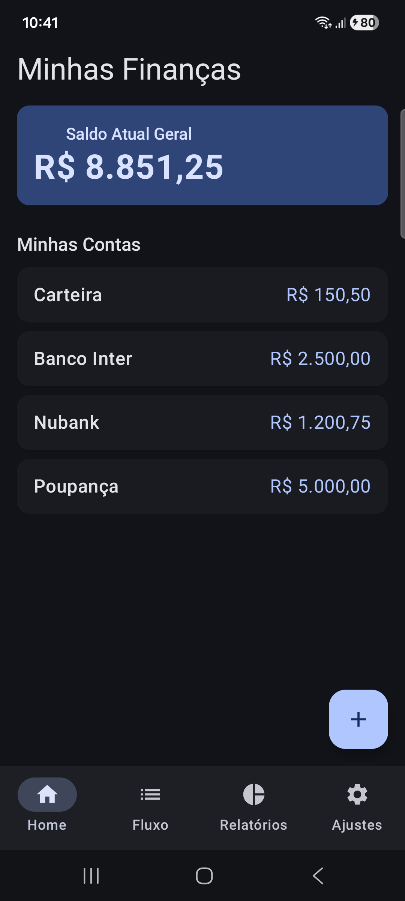
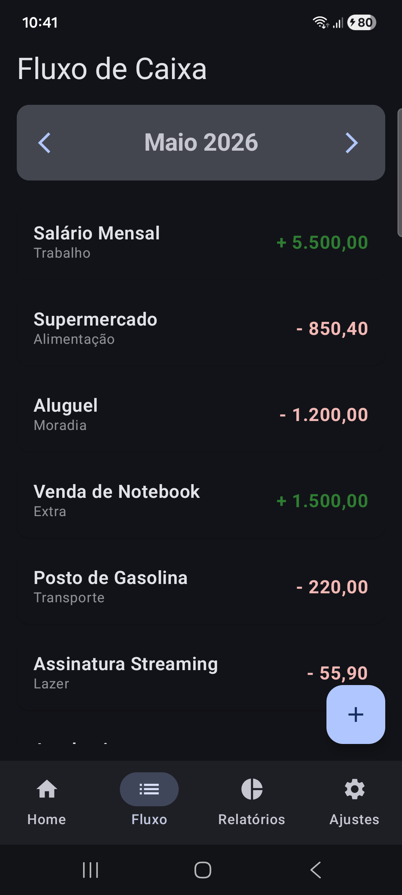
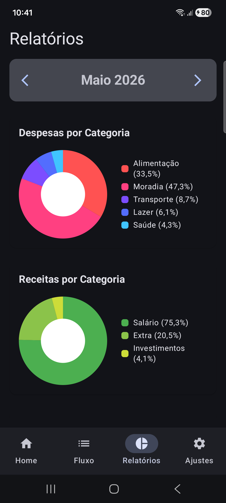

# 🪙 PROSPERA Organizador Financeiro Local

Prospera é um aplicativo Android nativo para gestão de finanças pessoais, operando de forma 100% offline, com foco em privacidade, velocidade e alta performance.

---

## 📱 Demonstração

<table align="center" width="100%">
  <tr>
    <td align="center" width="25%" valign="top">
      <h3>Home</h3>
      
    </td>
    <td align="center" width="25%" valign="top">
      <h3>Fluxo de Caixa</h3>
      
    </td>
    <td align="center" width="25%" valign="top">
      <h3>Relatórios</h3>
      
    </td>
    <td align="center" width="25%" valign="top">
      <h3>Navegação</h3>
      
    </td>
  </tr>
</table>

---

## 🚀 O Diferencial deste Projeto: Spec-Driven Development (SDD)

Este projeto não foi construído apenas escrevendo código de forma livre. Ele utiliza **Spec-Driven Development (SDD)** combinando engenharia de software tradicional com Inteligência Artificial generativa através do **Gemini Code CLI**.

### Como funciona o fluxo de engenharia aqui?
1. **Especificação Absoluta:** O comportamento, as telas e as regras de arquitetura são desenhados primeiro em arquivos Markdown na pasta `specs/`.
2. **Micro-Tarefas (Atomic Tasks):** O escopo é quebrado em tarefas minúsculas e independentes para evitar alucinações e garantir código limpo.
3. **Desenvolvimento Assistido:** O **Gemini CLI** consome essas especificações locais (`GEMINI.md` e `specs/`) e atua diretamente nos arquivos Kotlin, gerando código previsível, testável e estritamente alinhado às regras do projeto.

*Sinta-se à vontade para navegar pela pasta `/specs` e conferir as diretrizes que guiam a IA.*

---

## 🛠️ Stack Tecnológica & Arquitetura

O aplicativo foi projetado seguindo as melhores práticas recomendadas pela Google para o desenvolvimento Android moderno (MAD - Modern Android Development):

- **Linguagem:** [Kotlin](https://kotlinlang.org) (Coroutines, StateFlow, Clean Code)
- **Interface:** [Jetpack Compose](https://android.com) (Componentes exclusivos do Material Design 3)
- **Navegação:** Jetpack Navigation Compose (Arquitetura Single-Activity)
- **Persistência Local:** [Room Database](https://android.com) (SQLite encapsulado, planejado para a Fase 2)
- **Arquitetura:** **MVVM** (Model-View-ViewModel) combinada com princípios de **Clean Architecture** (Separação estrita de responsabilidades em camadas para viabilizar testes unitários futuros).

---

## 🗺️ Roadmap de Desenvolvimento (Fases do MVP)

O projeto está dividido em etapas incrementais e controladas para garantir a entrega contínua de valor:

- [X] **Fase 1: Layout e Navegação**
  - Configuração do `NavHost` e menu inferior unificado.
  - Tela Home: Exibição do saldo geral unificado e listagem detalhada por conta (dados estáticos).
  - Tela Fluxo de Caixa: Extrato de lançamentos mensais com paginação/filtro por mês (dados estáticos).
  - Tela Relatórios: Gráficos de relatórios mensais com paginação/filtro por mês (dados estáticos).
  - Tela Lancamentos: Lançamentos de Despesa/Receita (dados estáticos).
  - Tela Gerenciamento de Contas: CRUD de contas (dados estáticos).
  - Tela Gerenciamento de Categorias/Subcategorias: CRUD de categorias/subcategorias (dados estáticos).
  - BÔNUS: Resolvi criar um pipeline básico de CI/CD com Github Actions neste momento para garantir: Validação de Compilação, Verificação de Lint (Qualidade de Código) e Geração de APK automática.
- [X] **Fase 2: Persistência e Regras de Negócio**
  - Implementação do banco de dados local com Room.
  - Tela de Home funcionando com dados reais
  - Tela de Fluxo funcionando com dados reais
  - CRUD completo de Contas Bancárias.
  - CRUD completo de Categorias e Subcategorias.
  - Registro de lançamentos financeiros (Receitas e Despesas).
  - Transferências entre contas cadastradas.
- [ ] **Fase 3: Refinamento e Escalabilidade (Em andamento)**
  - Testes unitários para o pipeline CI
  - Implementação de gráficos de relatórios (Pizza/Barras) na aba dedicada.
  - Preparação para exportação e backup manual dos dados.

---

## 📁 Estrutura de Pastas de Arquitetura

O código segue a divisão clássica por recursos e camadas (Features/Layers):

```text
com.casamassa.prospera/
│
├── data/                  # Repositórios, Fontes de Dados (Room, DTOs)
├── domain/                # Modelos de Negócio Puro e Use Cases
└── presentation/          # Camada de Apresentação (Interface)
    ├── navigation/        # Controle de rotas da aplicação
    ├── theme/             # Design System (Cores, Tipos do Material 3)
    ├── components/        # Componentes reutilizáveis
    ├── home/              # Feature: Tela Inicial (Screen + ViewModel)
    ├── fluxo/             # Feature: Extrato Mensal (Screen + ViewModel)
    ├── relatorios/        # Feature: Relatório Mensal (Screen + ViewModel)
    ├── contas/            # Feature: Gerenciamento Contas (Screen + ViewModel)
    ├── categorias/        # Feature: Gerenciamento Categorias/Subcategotias (Screen + ViewModel)
    ├── lancamento/        # Feature: Form de lancamento Despesa/Receita (Form + ViewModel)
    └── configuracoes/     # Feature: Submenu acessivel pelo Bottom Menu Bar (Screen)
```

---

## 💻 Como Executar o Projeto

1. Clone este repositório:
   ```bash
   git clone https://github.com/casamassa/prospera.git
   ```
2. Abra o projeto no **Android Studio** (versão Ladybug ou superior recomendada).
3. Aguarde a sincronização do Gradle.
4. Execute o aplicativo no seu emulador ou dispositivo físico Android.
